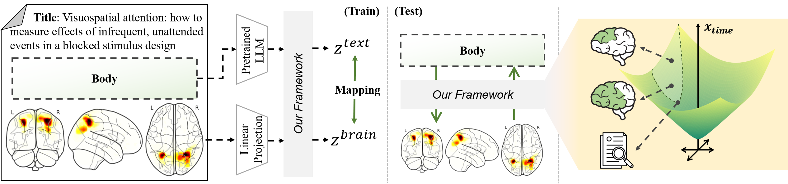

# [MICCAI'25 early accept] MNM: Multi-level Neuroimaging Meta-analysis with Hyperbolic Brain-Text Representations


- This is the official PyTorch implementation of ***MNM: Multi-level Neuroimaging Meta-analysis with Hyperbolic Brain-Text Representations.*** [Arxiv](https://arxiv.org/abs/2503.02899) | [Springer Link (Not Yet)](https://https://www.mms.com/en-us)

<br/>
<p align="center"></p>

## Summary
Neuroimaging studies often suffer from small sample sizes, which limit their reliability.  
Meta-analysis addresses this challenge by aggregating findings across studies to identify consistent patterns of brain activity. 
However, traditional approaches focus on keyword retrieval or linear mappings, which frequently overlook the hierarchical structure of the brain.  

In this work, we introduce a framework that leverages **hyperbolic geometry** to connect neuroscience literature with brain activation maps. By embedding research texts and brain activations into a shared hyperbolic space via the Lorentz model, our method captures both **semantic similarity** and **hierarchical organization**. Within this space, multi-level neuroimaging meta-analysis (MNM) is achieved by:  
1. Aligning brain and text embeddings for semantic correspondence,  
2. Guiding hierarchical relations between text and brain activations,  
3. Preserving multi-level structures within brain activation patterns.  

Experiments demonstrate that MNM outperforms baseline methods, providing a robust and interpretable paradigm for neuroimaging meta-analysis.

## Acknowledgements
This repository is built upon the code and dataset provided by [**NeuroConText: Contrastive Text-to-Brain Mapping for Neuroscientific Literature**](https://github.com/ghayem/NeuroConText).  
We sincerely thank the authors for making their code and data publicly available, which greatly facilitated our work.

## Citation
If you find our work useful for your research, please cite:
```
@inproceedings{baek2025mnm,
  title={MNM : Multi-level Neuroimaging Meta-analysis with Hyperbolic Brain-Text Representations},
  author={Baek, Seunghun and Lee, Jaejin and Sim, Jaeyoon and Jeong, Minjae and Kim, Won Hwa},
  booktitle={International Conference on Medical Image Computing and Computer-Assisted Intervention},
  year={2025},
  organization={Springer}
}

@inproceedings{meudec2024neurocontext,
  title={NeuroConText: Contrastive text-to-brain mapping for neuroscientific literature},
  author={Meudec, Rapha{\"e}l and Ghayem, Fateme and Dock{\`e}s, J{\'e}r{\^o}me and Wassermann, Demian and Thirion, Bertrand},
  booktitle={International Conference on Medical Image Computing and Computer-Assisted Intervention},
  pages={325--335},
  year={2024},
  organization={Springer}
}
```
