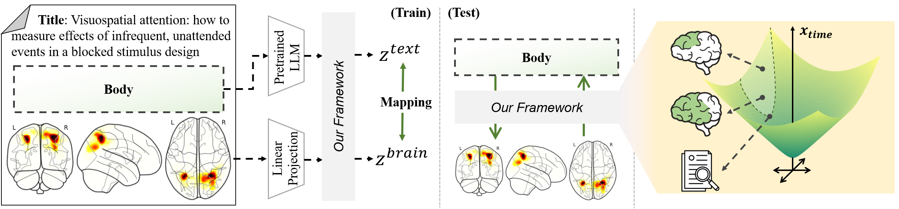

# [MICCAI'25 early accept] MNM: Multi-level Neuroimaging Meta-analysis with Hyperbolic Brain-Text Representations


- This is the official PyTorch implementation of ***MNM: Multi-level Neuroimaging Meta-analysis with Hyperbolic Brain-Text Representations.*** [Arxiv](https://arxiv.org/abs/2503.02899) | [Springer Link (Not Yet)](https://https://www.mms.com/en-us)

<br/>
<p align="center"></p>

## Abstract
Various neuroimaging studies suffer from small sample size problem which often limit their reliability. Meta-analysis addresses this challenge by aggregating findings from different studies to identify consistent patterns of brain activity. However, traditional approaches based on keyword retrieval or linear mappings often overlook the rich hierarchical structure in the brain. In this work, we propose a novel framework that leverages hyperbolic geometry to bridge the gap between neuroscience literature and brain activation maps. By embedding text from research articles and corresponding brain images into a shared hyperbolic space via the Lorentz model, our method captures both semantic similarity and hierarchical organization inherent in neuroimaging data. In the hyperbolic space, our method performs multi-level neuroimaging meta-analysis (MNM) by 1) aligning brain and text embeddings for semantic correspondence, 2) guiding hierarchy between text and brain activations, and 3) preserving the hierarchical relationships within brain activation patterns. Experimental results demonstrate that our model outperforms baselines, offering a robust and interpretable paradigm of multi-level neuroimaging meta-analysis via hyperbolic brain-text representation.

## Citation
If you find our work useful for your research, please cite the our paper:
```
@inproceedings{baek2025mnm,
  title={MNM : Multi-level Neuroimaging Meta-analysis with Hyperbolic Brain-Text Representations},
  author={Baek, Seunghun and Lee, Jaejin and Sim, Jaeyoon and Jeong, Minjae and Kim, Won Hwa},
  booktitle={International Conference on Medical Image Computing and Computer-Assisted Intervention},
  year={2025},
  organization={Springer}
}
```
